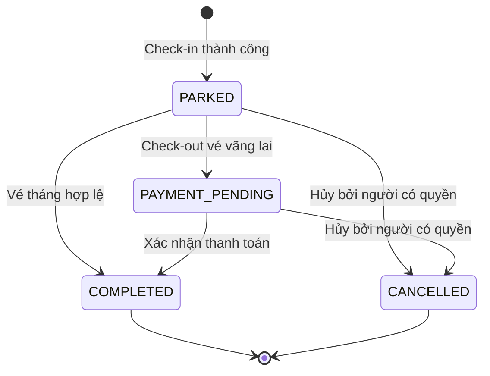
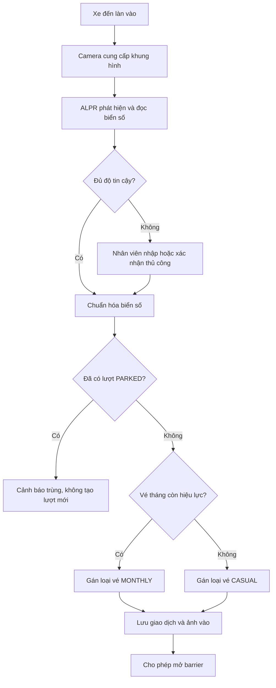
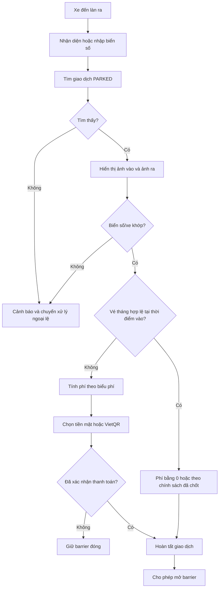

# TÀI LIỆU PHÂN TÍCH NGHIỆP VỤ VÀ ĐẶC TẢ YÊU CẦU PHẦN MỀM

## Hệ thống quản lý bãi đỗ xe thông minh VisionPark

| Thuộc tính | Nội dung |
| --- | --- |
| Mã tài liệu | VP-BA-SRS-001 |
| Phiên bản | 1.2.0 (Architecture Baseline) |
| Ngày cập nhật | 24/08/2026 |
| Chủ sở hữu | Business Analyst / Product Owner |
| Đối tượng sử dụng | Chủ đầu tư, vận hành bãi xe, BA, UI/UX, Dev, QA, DevOps |
| Phương pháp phát triển | Agile/Scrum, dự kiến 4 Sprint |
| Trạng thái | Chờ các bên liên quan rà soát và phê duyệt |

### Lịch sử thay đổi

| Phiên bản | Ngày | Người thực hiện | Nội dung |
| --- | --- | --- | --- |
| 1.0.0 | 24/08/2026 | PM / Tech Lead | Khởi tạo đặc tả kỹ thuật ban đầu |
| 1.1.0 | 24/08/2026 | BA | Chuẩn hóa phạm vi, yêu cầu nghiệp vụ, use case, tiêu chí nghiệm thu và truy vết yêu cầu |
| 1.2.0 | 24/08/2026 | BA / Tech Lead | Chốt FastAPI modular monolith, tách ALPR service và đồng bộ tài liệu kiến trúc |

---

## 1. Mục đích tài liệu

Tài liệu mô tả bài toán nghiệp vụ, phạm vi, quy tắc vận hành và yêu cầu phần mềm của VisionPark. Đây là cơ sở thống nhất giữa đơn vị nghiệp vụ và đội dự án để:

- Xác nhận hệ thống cần giải quyết vấn đề gì và phục vụ ai.
- Thiết kế giao diện, dữ liệu, API và kiến trúc phù hợp.
- Lập kế hoạch phát triển, kiểm thử, nghiệm thu và bàn giao.
- Quản lý thay đổi, tránh hiểu khác nhau giữa nghiệp vụ, Dev và QA.

Các nội dung có nhãn **Cần xác nhận** chưa được xem là yêu cầu cuối cùng và phải được Product Owner phê duyệt trước khi triển khai.

## 2. Bối cảnh và mục tiêu nghiệp vụ

### 2.1. Bối cảnh

Quy trình kiểm soát xe thủ công dễ xảy ra nhập sai biển số, thất lạc vé, ùn tắc tại cổng, sai lệch khi tính phí và khó đối soát doanh thu. VisionPark sử dụng nhận diện biển số tự động (ALPR), lưu ảnh vào/ra và quản lý giao dịch tập trung nhằm giảm thao tác thủ công nhưng vẫn cho phép nhân viên can thiệp khi nhận diện không chính xác.

### 2.2. Mục tiêu

| ID | Mục tiêu | Chỉ số đánh giá đề xuất |
| --- | --- | --- |
| OBJ-01 | Rút ngắn thời gian xử lý tại cổng | 95% lượt xe được xử lý trong thời gian mục tiêu đã thống nhất |
| OBJ-02 | Giảm sai sót nhận diện và đối soát | 100% lượt sửa biển số được lưu lịch sử người sửa và lý do |
| OBJ-03 | Minh bạch doanh thu | Giao dịch thu phí truy vết được theo ca, người vận hành và phương thức thanh toán |
| OBJ-04 | Nâng cao khả năng giám sát | Có số liệu xe đang trong bãi, lượt vào/ra và doanh thu gần thời gian thực |
| OBJ-05 | Duy trì vận hành khi AI gặp lỗi | Có luồng nhập tay và xử lý ngoại lệ không làm mất giao dịch |

> **Cần xác nhận:** thời gian xử lý mục tiêu, độ chính xác ALPR mục tiêu, số làn, sức chứa, loại phương tiện và thời gian lưu ảnh.

## 3. Phạm vi

### 3.1. Trong phạm vi phiên bản MVP

- Giám sát luồng video của làn vào và làn ra.
- Phát hiện, đọc và chuẩn hóa biển số xe từ hình ảnh/video.
- Ghi nhận xe vào, lưu biển số, thời gian, làn và ảnh vào.
- Tìm lượt gửi đang mở khi xe ra, hiển thị ảnh vào/ra để đối chiếu.
- Phân loại vé tháng và vé vãng lai.
- Tính phí theo biểu phí được cấu hình.
- Thanh toán tiền mặt hoặc tạo mã VietQR; cho phép nhân viên xác nhận đã thu tiền.
- Quản lý vé tháng, biểu phí, tài khoản và phân quyền cơ bản.
- Tra cứu lịch sử, thống kê xe trong bãi, lượt vào/ra và doanh thu.
- Ghi nhật ký thao tác quan trọng và hỗ trợ nhập/sửa biển số thủ công.
- Mô phỏng camera bằng video để demo và kiểm thử khi chưa có thiết bị thật.

### 3.2. Ngoài phạm vi MVP

- Đặt chỗ trước qua ứng dụng khách hàng.
- Dẫn đường đến từng vị trí đỗ trống.
- Nhận diện khuôn mặt người điều khiển.
- Ví điện tử nội bộ, chương trình khách hàng thân thiết.
- Xuất hóa đơn điện tử và tích hợp phần mềm kế toán.
- Đồng bộ nhiều bãi xe hoặc trung tâm điều hành đa chi nhánh.
- Tự động xác nhận biến động số dư ngân hàng nếu chưa có dịch vụ đối soát thanh toán.
- Điều khiển barrier thật nếu chưa chốt giao thức và nhà cung cấp thiết bị.

### 3.3. Giả định và ràng buộc

- Mỗi làn có camera hoặc nguồn video đủ chất lượng để nhìn rõ biển số.
- Đồng hồ của các dịch vụ được đồng bộ; thời gian nghiệp vụ dùng múi giờ `Asia/Ho_Chi_Minh`.
- Một biển số chỉ có tối đa một lượt gửi ở trạng thái `PARKED` trong cùng một bãi.
- Nhân viên chỉ mở barrier sau khi hệ thống cho phép hoặc thực hiện mở cưỡng bức có ghi lý do.
- Mức phí, khung giờ, quy tắc làm tròn và chính sách mất vé do đơn vị vận hành cung cấp.
- MVP dự kiến phục vụ một bãi xe; thiết kế nên có khả năng bổ sung `parking_lot_id` khi mở rộng.

## 4. Các bên liên quan và người dùng

| Vai trò | Trách nhiệm / nhu cầu chính |
| --- | --- |
| Product Owner / Chủ bãi xe | Phê duyệt phạm vi, biểu phí, quy trình và tiêu chí nghiệm thu |
| Quản trị viên | Quản lý tài khoản, phân quyền, làn, biểu phí, vé tháng và báo cáo |
| Nhân viên vận hành / Bảo vệ | Theo dõi làn, xác nhận biển số, xử lý xe vào/ra, thu phí và ngoại lệ |
| Kế toán / Quản lý ca | Đối soát doanh thu, phương thức thanh toán và báo cáo theo ca |
| Kỹ thuật viên | Cấu hình camera, theo dõi trạng thái dịch vụ và xử lý sự cố |
| Khách gửi xe | Được xử lý nhanh, đúng phương tiện, đúng mức phí và an toàn dữ liệu |
| BA / Dev / QA / DevOps | Phân tích, triển khai, kiểm thử và vận hành hệ thống theo tài liệu đã duyệt |

## 5. Thuật ngữ và trạng thái

| Thuật ngữ | Diễn giải |
| --- | --- |
| ALPR | Automatic License Plate Recognition – nhận diện biển số tự động |
| Check-in | Ghi nhận phương tiện đi vào bãi |
| Check-out | Đối soát, thanh toán và ghi nhận phương tiện rời bãi |
| Vé tháng | Quyền gửi xe có hiệu lực trong một khoảng thời gian đã đăng ký |
| Vé vãng lai | Lượt gửi xe tính phí theo thời gian hoặc chính sách hiện hành |
| Giao dịch đang mở | Lượt gửi có trạng thái `PARKED`, chưa hoàn tất check-out |
| Manual override | Nhân viên sửa dữ liệu hoặc mở barrier thủ công có kiểm soát |
| VietQR | Dữ liệu/mã QR hỗ trợ khách chuyển khoản theo thông tin thanh toán |

### Vòng đời giao dịch gửi xe



## 6. Quy trình nghiệp vụ tổng quan

### 6.1. Luồng xe vào



### 6.2. Luồng xe ra



## 7. Quy tắc nghiệp vụ

| ID | Quy tắc |
| --- | --- |
| BR-01 | Biển số được chuẩn hóa bằng cách viết hoa và loại bỏ khoảng trắng, dấu chấm, dấu gạch không mang ý nghĩa trước khi tìm kiếm |
| BR-02 | Không tạo lượt check-in mới nếu cùng biển số đang có giao dịch `PARKED`; nhân viên phải xử lý bản ghi trùng |
| BR-03 | Vé tháng hợp lệ khi đang hoạt động và thời điểm check-in nằm trong khoảng từ ngày bắt đầu đến hết ngày hết hạn |
| BR-04 | Hệ thống phải lưu cả kết quả ALPR ban đầu và biển số cuối cùng do nhân viên xác nhận |
| BR-05 | Mọi sửa biển số, hủy giao dịch, miễn/giảm phí và mở barrier cưỡng bức phải lưu người thực hiện, thời gian, giá trị trước/sau và lý do |
| BR-06 | Xe vãng lai chỉ được mở barrier ra khi thanh toán đã được xác nhận, trừ người có quyền thực hiện override |
| BR-07 | Phí gửi xe được tính bằng biểu phí có hiệu lực tại thời điểm được nghiệp vụ quy định; không tự thay đổi giao dịch đã hoàn tất khi biểu phí mới được ban hành |
| BR-08 | Tổng tiền không được âm; mọi miễn/giảm phải có loại lý do và quyền phù hợp |
| BR-09 | Một giao dịch hoàn tất phải có thời gian ra không nhỏ hơn thời gian vào |
| BR-10 | Không xóa vật lý giao dịch đã phát sinh; chỉ hủy logic và giữ dấu vết kiểm toán |
| BR-11 | Số xe đang trong bãi bằng số giao dịch `PARKED` hợp lệ; không cho check-in khi đạt sức chứa, trừ override được cấp quyền |
| BR-12 | Mã VietQR phải chứa đúng số tiền và mã tham chiếu duy nhất của giao dịch; việc tạo QR không đồng nghĩa đã thanh toán |
| BR-13 | Báo cáo doanh thu chỉ tính các giao dịch đã hoàn tất và đã xác nhận thanh toán, theo múi giờ của bãi xe |
| BR-14 | Ảnh vào/ra không được cung cấp công khai; chỉ người dùng đã xác thực và có quyền mới truy cập được |

> **Cần xác nhận:** thời điểm chọn biểu phí (check-in hay check-out), cách làm tròn thời gian, phí qua đêm, thời gian miễn phí, chính sách vé tháng hết hạn khi xe còn trong bãi, mất vé, xe không biển số và biển số ngoại lệ.

## 8. Yêu cầu chức năng

### 8.1. Xác thực và phân quyền

| ID | Mức ưu tiên | Yêu cầu / tiêu chí chấp nhận tóm tắt |
| --- | --- | --- |
| FR-AUTH-01 | Must | Người dùng đăng nhập bằng tài khoản đang hoạt động; sai thông tin không được tạo phiên |
| FR-AUTH-02 | Must | Hệ thống hỗ trợ tối thiểu các vai trò `ADMIN`, `OPERATOR`, `ACCOUNTANT`, `TECHNICIAN` |
| FR-AUTH-03 | Must | Hệ thống kiểm tra quyền ở cả API và màn hình; ẩn nút trên UI không thay thế kiểm tra quyền backend |
| FR-AUTH-04 | Must | Quản trị viên có thể tạo, khóa, mở khóa và đặt lại mật khẩu tài khoản |
| FR-AUTH-05 | Should | Phiên hết hạn sau thời gian không hoạt động được cấu hình và yêu cầu đăng nhập lại |

### 8.2. Nhận diện biển số và giám sát làn

| ID | Mức ưu tiên | Yêu cầu / tiêu chí chấp nhận tóm tắt |
| --- | --- | --- |
| FR-ALPR-01 | Must | Nhận khung hình từ nguồn video và trả về biển số, bounding box, confidence và thời gian xử lý |
| FR-ALPR-02 | Must | Hỗ trợ biển số một dòng và hai dòng trong tập dữ liệu mục tiêu |
| FR-ALPR-03 | Must | Khi confidence thấp hơn ngưỡng cấu hình, UI yêu cầu nhân viên xác nhận hoặc nhập tay |
| FR-ALPR-04 | Must | UI hiển thị trạng thái nguồn video: hoạt động, mất kết nối hoặc lỗi |
| FR-ALPR-05 | Should | Chống tạo nhiều sự kiện cho cùng một xe trong khoảng chống lặp được cấu hình |
| FR-ALPR-06 | Should | Lưu phiên bản model và confidence cùng sự kiện để phục vụ đánh giá chất lượng |

### 8.3. Check-in

| ID | Mức ưu tiên | Yêu cầu / tiêu chí chấp nhận tóm tắt |
| --- | --- | --- |
| FR-IN-01 | Must | Tạo giao dịch gồm biển số, loại xe, loại vé, thời gian, làn, ảnh vào và người xác nhận |
| FR-IN-02 | Must | Tự động kiểm tra vé tháng còn hiệu lực theo biển số đã chuẩn hóa |
| FR-IN-03 | Must | Phát hiện lượt đang mở trùng biển số và không tạo bản ghi thứ hai |
| FR-IN-04 | Must | Chỉ trả `allow_open=true` sau khi giao dịch đã lưu thành công |
| FR-IN-05 | Must | Khi AI lỗi, nhân viên có thể nhập biển số thủ công; hệ thống đánh dấu nguồn dữ liệu `MANUAL` |
| FR-IN-06 | Should | Kiểm tra sức chứa trước khi cho phép xe vào |

### 8.4. Check-out và thanh toán

| ID | Mức ưu tiên | Yêu cầu / tiêu chí chấp nhận tóm tắt |
| --- | --- | --- |
| FR-OUT-01 | Must | Tìm đúng giao dịch `PARKED` theo biển số; nếu không tìm thấy phải cảnh báo và không tự mở barrier |
| FR-OUT-02 | Must | Hiển thị cạnh nhau biển số, thời gian và ảnh vào/ra để nhân viên đối chiếu |
| FR-OUT-03 | Must | Tính phí theo loại xe, khoảng thời gian và phiên bản biểu phí áp dụng; lưu chi tiết kết quả tính |
| FR-OUT-04 | Must | Hỗ trợ `CASH` và `BANK_TRANSFER`; trạng thái thanh toán gồm `PENDING`, `PAID`, `WAIVED`, `FAILED` |
| FR-OUT-05 | Must | Với chuyển khoản, tạo VietQR có số tiền và mã tham chiếu giao dịch |
| FR-OUT-06 | Must | Chỉ hoàn tất giao dịch và cho mở barrier sau khi đáp ứng BR-06 |
| FR-OUT-07 | Must | Yêu cầu lý do và quyền phù hợp khi chỉnh phí, miễn phí hoặc mở barrier cưỡng bức |
| FR-OUT-08 | Should | Chống gửi lặp thao tác check-out để không tạo nhiều khoản thanh toán hoặc cập nhật sai trạng thái |

### 8.5. Vé tháng

| ID | Mức ưu tiên | Yêu cầu / tiêu chí chấp nhận tóm tắt |
| --- | --- | --- |
| FR-MT-01 | Must | Thêm, xem, sửa, ngừng kích hoạt và tra cứu vé tháng |
| FR-MT-02 | Must | Dữ liệu tối thiểu gồm biển số, chủ xe, số điện thoại, loại xe, ngày hiệu lực và ngày hết hạn |
| FR-MT-03 | Must | Không cho phép hai vé tháng đang hiệu lực bị trùng biển số trong cùng phạm vi áp dụng |
| FR-MT-04 | Should | Lọc vé sắp hết hạn, đã hết hạn và xuất danh sách CSV/XLSX |

### 8.6. Biểu phí

| ID | Mức ưu tiên | Yêu cầu / tiêu chí chấp nhận tóm tắt |
| --- | --- | --- |
| FR-PR-01 | Must | Quản trị viên tạo và xem phiên bản biểu phí theo loại xe và thời gian hiệu lực |
| FR-PR-02 | Must | Không cho lưu biểu phí có khoảng hiệu lực chồng lấn trong cùng loại xe/phạm vi |
| FR-PR-03 | Must | Cho phép mô phỏng số tiền từ thời gian vào/ra trước khi kích hoạt biểu phí |
| FR-PR-04 | Must | Không sửa trực tiếp biểu phí đã được giao dịch tham chiếu; thay đổi phải tạo phiên bản mới |

### 8.7. Tra cứu, dashboard và báo cáo

| ID | Mức ưu tiên | Yêu cầu / tiêu chí chấp nhận tóm tắt |
| --- | --- | --- |
| FR-RP-01 | Must | Tra cứu giao dịch theo biển số, thời gian, loại vé, trạng thái, làn và phương thức thanh toán |
| FR-RP-02 | Must | Xem chi tiết giao dịch, ảnh vào/ra, lịch sử thay đổi và thanh toán |
| FR-RP-03 | Must | Dashboard hiển thị xe đang trong bãi, sức chứa, lượt vào/ra và doanh thu trong ngày |
| FR-RP-04 | Must | Báo cáo doanh thu lọc theo thời gian, ca, người vận hành và phương thức thanh toán |
| FR-RP-05 | Should | Xuất báo cáo CSV/XLSX; dữ liệu xuất phải theo đúng bộ lọc và quyền người dùng |

### 8.8. Cấu hình, giám sát và nhật ký

| ID | Mức ưu tiên | Yêu cầu / tiêu chí chấp nhận tóm tắt |
| --- | --- | --- |
| FR-SYS-01 | Must | Quản lý làn, hướng làn, nguồn video và trạng thái kích hoạt |
| FR-SYS-02 | Must | Ghi audit log cho đăng nhập, thay đổi cấu hình, vé tháng, biểu phí, giao dịch và override |
| FR-SYS-03 | Must | Audit log chỉ được xem bởi vai trò có quyền và không cho sửa/xóa qua chức năng nghiệp vụ |
| FR-SYS-04 | Should | Hiển thị tình trạng AI, API, cơ sở dữ liệu, camera và dung lượng lưu trữ |

## 9. Đặc tả use case trọng yếu

### UC-01 – Ghi nhận xe vào

| Thuộc tính | Nội dung |
| --- | --- |
| Tác nhân chính | Nhân viên vận hành |
| Tiền điều kiện | Người dùng đã đăng nhập; làn vào hoạt động; hệ thống còn khả năng tiếp nhận |
| Kích hoạt | Camera phát hiện xe hoặc nhân viên chủ động chụp/nhập biển số |
| Luồng chính | (1) Hệ thống nhận ảnh. (2) ALPR đọc biển số. (3) Nhân viên xác nhận nếu cần. (4) Hệ thống kiểm tra trùng và vé tháng. (5) Lưu giao dịch `PARKED` cùng ảnh. (6) Cho phép mở barrier. |
| Ngoại lệ | Không đọc được biển số; biển số trùng lượt đang mở; bãi đầy; mất kết nối camera; lỗi lưu ảnh/DB |
| Hậu điều kiện | Có đúng một giao dịch đang mở hoặc hệ thống từ chối có lý do; mọi can thiệp được ghi log |

**Acceptance criteria**

```gherkin
Scenario: Xe vãng lai vào bãi thành công
  Given làn vào đang hoạt động và bãi chưa đầy
  And biển số "29A12345" không có giao dịch PARKED
  When nhân viên xác nhận kết quả nhận diện "29A12345"
  Then hệ thống tạo một giao dịch loại CASUAL ở trạng thái PARKED
  And lưu ảnh vào, thời gian và làn vào
  And trả kết quả cho phép mở barrier

Scenario: Từ chối lượt vào trùng
  Given biển số "29A12345" đã có một giao dịch PARKED
  When hệ thống nhận yêu cầu check-in mới cho cùng biển số
  Then hệ thống không tạo giao dịch mới
  And hiển thị cảnh báo để nhân viên xử lý
```

### UC-02 – Hoàn tất xe ra và thu phí

| Thuộc tính | Nội dung |
| --- | --- |
| Tác nhân chính | Nhân viên vận hành |
| Tác nhân phụ | Dịch vụ ALPR, dịch vụ VietQR |
| Tiền điều kiện | Có giao dịch `PARKED` hợp lệ |
| Kích hoạt | Xe xuất hiện tại làn ra |
| Luồng chính | (1) Nhận diện biển số. (2) Tìm lượt đang mở. (3) Hiển thị đối chiếu. (4) Tính phí. (5) Thu/xác nhận thanh toán. (6) Lưu ảnh ra và hoàn tất. (7) Cho phép mở barrier. |
| Ngoại lệ | Không tìm thấy lượt vào; ảnh/biển số không khớp; không tạo được QR; thanh toán thất bại; yêu cầu miễn/giảm; mất kết nối barrier |
| Hậu điều kiện | Giao dịch `COMPLETED` và có thông tin thanh toán, hoặc vẫn giữ trạng thái chưa hoàn tất |

**Acceptance criteria**

```gherkin
Scenario: Xe vãng lai thanh toán tiền mặt thành công
  Given biển số "29A12345" có một giao dịch PARKED loại CASUAL
  When hệ thống tính phí là 10000 đồng
  And nhân viên xác nhận đã nhận đủ tiền mặt
  Then thanh toán có trạng thái PAID và phương thức CASH
  And giao dịch chuyển sang COMPLETED
  And hệ thống cho phép mở barrier

Scenario: Chưa xác nhận chuyển khoản
  Given hệ thống đã tạo VietQR cho một giao dịch
  When chưa có người dùng hoặc dịch vụ được phép xác nhận thanh toán
  Then giao dịch không được chuyển sang COMPLETED
  And barrier vẫn đóng
```

### UC-03 – Sửa biển số thủ công

| Thuộc tính | Nội dung |
| --- | --- |
| Tác nhân chính | Nhân viên vận hành có quyền |
| Tiền điều kiện | Có kết quả nhận diện cần điều chỉnh |
| Luồng chính | (1) Chọn sửa. (2) Nhập biển số mới và lý do. (3) Hệ thống kiểm tra định dạng/quyền/trùng. (4) Lưu giá trị mới. (5) Ghi audit log giá trị cũ và mới. |
| Ngoại lệ | Không có quyền; biển số rỗng/sai định dạng; tạo trùng giao dịch đang mở |
| Hậu điều kiện | Dữ liệu cuối cùng được dùng cho nghiệp vụ nhưng vẫn truy vết được kết quả AI ban đầu |

## 10. Yêu cầu dữ liệu

### 10.1. Thực thể chính

| Thực thể | Thuộc tính nghiệp vụ tối thiểu |
| --- | --- |
| User | ID, tên đăng nhập, tên hiển thị, mật khẩu băm, vai trò, trạng thái, lần đăng nhập cuối |
| Lane | ID, tên làn, hướng `IN/OUT`, nguồn video, trạng thái |
| MonthlyTicket | ID, biển số chuẩn hóa, chủ xe, điện thoại, loại xe, hiệu lực, trạng thái |
| PricingRule | ID, phiên bản, loại xe, cách tính, khung giờ, số tiền, hiệu lực, trạng thái |
| ParkingTransaction | ID, biển số AI, biển số xác nhận, loại xe/vé, thời gian/ảnh/làn vào-ra, trạng thái, người xử lý |
| Payment | ID, mã giao dịch, phương thức, số tiền, trạng thái, mã tham chiếu, người/thời điểm xác nhận |
| AuditLog | ID, người dùng, hành động, đối tượng, dữ liệu trước/sau, lý do, thời gian, IP |

### 10.2. Kiểm tra và toàn vẹn dữ liệu

- ID giao dịch dùng UUID và không tái sử dụng.
- Tiền tệ mặc định là VND, lưu số nguyên đồng để tránh sai số thập phân.
- Thời gian lưu theo định dạng có múi giờ; hiển thị theo múi giờ bãi xe.
- Biển số lưu cả `raw_plate_number` và `normalized_plate_number`.
- Ảnh lưu trong kho riêng; cơ sở dữ liệu chỉ lưu định danh/đường dẫn nội bộ và metadata.
- Các trường trạng thái dùng tập giá trị kiểm soát, không cho nhập chuỗi tùy ý.
- Cần có index tối thiểu theo biển số chuẩn hóa + trạng thái, thời gian vào/ra và trạng thái thanh toán.
- Ràng buộc hoặc cơ chế khóa phải ngăn hai yêu cầu đồng thời tạo hai lượt `PARKED` cho cùng biển số.

### 10.3. Chính sách lưu trữ

> **Cần xác nhận với nghiệp vụ và pháp lý:** thời gian lưu giao dịch, ảnh, audit log và bản sao lưu; quy trình cung cấp/xóa dữ liệu cá nhân; người được phép tải ảnh và báo cáo.

## 11. Yêu cầu phi chức năng

| ID | Nhóm | Yêu cầu đề xuất / tiêu chí đo |
| --- | --- | --- |
| NFR-01 | Hiệu năng | API nghiệp vụ thông thường có p95 không quá 2 giây trong tải mục tiêu; phản hồi ALPR có p95 không quá 3 giây, chưa tính độ trễ nguồn video |
| NFR-02 | Tải | Hỗ trợ đồng thời số làn và người dùng theo cấu hình triển khai; phải kiểm thử tải sau khi chốt quy mô |
| NFR-03 | Sẵn sàng | Lỗi AI không được làm mất khả năng xử lý thủ công; lỗi một làn không làm hỏng dữ liệu làn khác |
| NFR-04 | Tin cậy | Check-in, check-out và xác nhận thanh toán phải có tính idempotent hoặc cơ chế chống gửi lặp |
| NFR-05 | Bảo mật | Toàn bộ API yêu cầu xác thực trừ health check; áp dụng RBAC và nguyên tắc quyền tối thiểu |
| NFR-06 | Bảo mật | Mật khẩu băm bằng thuật toán phù hợp; không ghi mật khẩu, token, payload QR nhạy cảm vào log |
| NFR-07 | Truyền dữ liệu | Dùng HTTPS/TLS ở môi trường thật; URL ảnh phải có kiểm soát truy cập và thời hạn nếu dùng signed URL |
| NFR-08 | Kiểm toán | Các thao tác theo BR-05 phải truy vết đầy đủ và không thể sửa bằng UI/API nghiệp vụ |
| NFR-09 | Sao lưu | Có lịch sao lưu DB và kiểm thử phục hồi định kỳ; RPO/RTO cần được Product Owner phê duyệt |
| NFR-10 | Khả dụng | Trạm vận hành ưu tiên thao tác bàn phím, cảnh báo dễ nhận biết, không chỉ dựa vào màu sắc |
| NFR-11 | Tương thích | Giao diện quản trị hỗ trợ hai phiên bản gần nhất của Chrome/Edge tại thời điểm nghiệm thu |
| NFR-12 | Quan sát | Log có correlation ID; có health check và chỉ số lỗi, độ trễ, hàng đợi, dung lượng ảnh |
| NFR-13 | AI | Báo cáo độ chính xác trên tập kiểm thử đại diện theo điều kiện sáng/tối, góc chụp và loại biển số |
| NFR-14 | Riêng tư | Chỉ thu thập dữ liệu cần thiết, giới hạn quyền xem/tải ảnh và tuân thủ chính sách lưu trữ được duyệt |

## 12. Giao diện và tích hợp

### 12.1. Màn hình dự kiến

| Mã | Màn hình | Nội dung chính |
| --- | --- | --- |
| UI-01 | Đăng nhập | Tài khoản, mật khẩu, thông báo lỗi |
| UI-02 | Trạm vận hành | Video làn vào/ra, kết quả ALPR, ảnh đối chiếu, phí, QR, cảnh báo và hành động nhanh |
| UI-03 | Dashboard | Sức chứa, xe đang gửi, lượt vào/ra, doanh thu, cảnh báo dịch vụ |
| UI-04 | Giao dịch | Bộ lọc, danh sách, chi tiết, ảnh và lịch sử thay đổi |
| UI-05 | Vé tháng | Danh sách, tạo/sửa, kích hoạt, lọc hết hạn |
| UI-06 | Biểu phí | Phiên bản, khoảng hiệu lực, mô phỏng phí, kích hoạt |
| UI-07 | Báo cáo | Doanh thu/lưu lượng theo thời gian, ca, người dùng, phương thức |
| UI-08 | Quản trị hệ thống | Tài khoản, vai trò, làn, camera, cấu hình và audit log |

### 12.2. Nguyên tắc API

- Base path: `/api/v1`.
- Dùng JSON UTF-8; thời gian theo ISO 8601 có timezone.
- Mỗi yêu cầu tạo/cập nhật quan trọng hỗ trợ `Idempotency-Key` hoặc khóa nghiệp vụ tương đương.
- Phản hồi lỗi thống nhất gồm `code`, `message`, `details`, `correlation_id`.
- API danh sách hỗ trợ phân trang, sắp xếp và bộ lọc có giới hạn.
- Không trả đường dẫn file hệ thống; trả URL/ID ảnh đã được kiểm soát quyền.

#### Nhận diện biển số

```http
POST /api/v1/alpr/detections
Content-Type: multipart/form-data
Authorization: Bearer <token>
```

```json
{
  "detection_id": "6e398f71-871f-46d2-b57c-f1efc654d20a",
  "raw_plate_number": "29A-123.45",
  "normalized_plate_number": "29A12345",
  "bbox": [120, 340, 250, 410],
  "confidence": 0.95,
  "model_version": "alpr-1.0.0",
  "requires_confirmation": false
}
```

#### Check-in

```http
POST /api/v1/parking-transactions/check-in
Idempotency-Key: <uuid>
```

```json
{
  "plate_number": "29A12345",
  "vehicle_type": "CAR",
  "lane_id": "LANE_IN_01",
  "image_id": "img_01",
  "detection_id": "6e398f71-871f-46d2-b57c-f1efc654d20a"
}
```

```json
{
  "transaction_id": "8f3b2a1c-6af8-4c1e-b395-d70117527a31",
  "ticket_type": "MONTHLY",
  "status": "PARKED",
  "allow_open": true
}
```

#### Tính phí và check-out

```http
POST /api/v1/parking-transactions/{transaction_id}/checkout-quote
POST /api/v1/parking-transactions/{transaction_id}/complete
```

Việc tách bước báo phí và hoàn tất giúp hệ thống không đánh dấu xe đã ra trước khi thanh toán được xác nhận.

```json
{
  "transaction_id": "8f3b2a1c-6af8-4c1e-b395-d70117527a31",
  "time_in": "2026-08-24T08:00:00+07:00",
  "quoted_time_out": "2026-08-24T10:00:00+07:00",
  "amount": 10000,
  "currency": "VND",
  "pricing_rule_version": "CAR-2026-01"
}
```

#### Mã lỗi nghiệp vụ tối thiểu

| HTTP | Code | Ý nghĩa |
| --- | --- | --- |
| 400 | `INVALID_PLATE_NUMBER` | Biển số không hợp lệ hoặc chưa được xác nhận |
| 401 | `UNAUTHENTICATED` | Chưa đăng nhập hoặc phiên hết hạn |
| 403 | `FORBIDDEN` | Không có quyền thực hiện |
| 404 | `OPEN_TRANSACTION_NOT_FOUND` | Không tìm thấy lượt gửi đang mở |
| 409 | `DUPLICATE_OPEN_TRANSACTION` | Biển số đã có lượt đang mở |
| 409 | `TRANSACTION_STATE_CONFLICT` | Trạng thái hiện tại không cho phép thao tác |
| 422 | `PAYMENT_NOT_CONFIRMED` | Chưa đủ điều kiện hoàn tất thanh toán |
| 503 | `DEPENDENCY_UNAVAILABLE` | Camera, ALPR, QR hoặc dịch vụ phụ thuộc không sẵn sàng |

### 12.3. Tích hợp thiết bị và dịch vụ

| Hệ thống | Dữ liệu trao đổi | Phương án khi lỗi |
| --- | --- | --- |
| Camera / MediaMTX | Luồng video hoặc ảnh chụp | Báo mất kết nối; cho phép chụp/nhập thủ công |
| Dịch vụ ALPR | Ảnh vào; biển số, bbox, confidence trả ra | Cho phép nhập tay; lưu trạng thái lỗi |
| VietQR | Số tiền, nội dung, tài khoản nhận | Cho phép chọn tiền mặt hoặc thử tạo lại |
| Barrier | Lệnh mở và trạng thái thiết bị | Cảnh báo; mở thủ công có audit nếu được cấp quyền |

> Giao thức barrier, ngân hàng nhận tiền, cơ chế xác nhận chuyển khoản và yêu cầu mạng cần được chốt trước khi thiết kế tích hợp production.

## 13. Phân quyền đề xuất

| Chức năng | Admin | Operator | Accountant | Technician |
| --- | :---: | :---: | :---: | :---: |
| Xử lý xe vào/ra | Có | Có | Không | Có giới hạn |
| Sửa biển số / override | Có | Theo quyền | Không | Không |
| Quản lý vé tháng | Có | Xem | Xem | Không |
| Quản lý biểu phí | Có | Xem | Xem | Không |
| Xem giao dịch | Có | Có | Có | Có giới hạn |
| Xem/xuất báo cáo doanh thu | Có | Theo quyền | Có | Không |
| Quản lý tài khoản và quyền | Có | Không | Không | Không |
| Cấu hình camera/làn | Có | Không | Không | Có |
| Xem audit log | Có | Không | Theo quyền | Theo quyền |

Ma trận trên là đề xuất ban đầu; Product Owner phải phê duyệt quyền override, xem ảnh và xuất dữ liệu.

## 14. Kế hoạch kiểm thử và nghiệm thu

### 14.1. Phạm vi kiểm thử

- Unit test cho chuẩn hóa biển số, tính phí và chuyển trạng thái.
- Integration test cho DB, ALPR, lưu ảnh, QR và phân quyền API.
- E2E test cho toàn bộ luồng xe vào, xe ra, vé tháng, vãng lai và ngoại lệ.
- Kiểm thử đồng thời/idempotency cho check-in, check-out và thanh toán.
- Kiểm thử bảo mật cơ bản: xác thực, phân quyền, truy cập ảnh, injection, rate limit.
- Kiểm thử tải theo số làn và tần suất xe đã chốt.
- Đánh giá ALPR trên tập dữ liệu riêng, không trùng dữ liệu huấn luyện.
- Kiểm thử phục hồi từ bản sao lưu trước khi bàn giao production.

### 14.2. Bộ kịch bản UAT tối thiểu

| ID | Kịch bản | Kết quả mong đợi |
| --- | --- | --- |
| UAT-01 | Xe vãng lai vào và trả tiền mặt khi ra | Lưu đủ ảnh/thời gian; tính đúng phí; giao dịch hoàn tất |
| UAT-02 | Xe vé tháng còn hạn vào/ra | Nhận đúng loại vé; áp dụng chính sách phí đã duyệt |
| UAT-03 | AI đọc sai biển số | Nhân viên sửa được; audit lưu giá trị cũ/mới và lý do |
| UAT-04 | Check-in trùng biển số | Không sinh giao dịch thứ hai; hiển thị cảnh báo |
| UAT-05 | Xe ra không có lượt vào | Không mở barrier tự động; chuyển luồng ngoại lệ |
| UAT-06 | Chuyển khoản chưa xác nhận | Không hoàn tất giao dịch; barrier vẫn đóng |
| UAT-07 | Mất camera/AI | Nhân viên vẫn xử lý thủ công theo quyền |
| UAT-08 | Người dùng không đủ quyền chỉnh phí | Backend từ chối và ghi nhận sự kiện bảo mật phù hợp |
| UAT-09 | Thay biểu phí | Giao dịch cũ giữ phiên bản phí; giao dịch mới dùng phiên bản có hiệu lực |
| UAT-10 | Đối soát doanh thu | Tổng báo cáo khớp tổng thanh toán hợp lệ theo bộ lọc |

### 14.3. Điều kiện nghiệm thu MVP

- 100% yêu cầu mức `Must` được triển khai hoặc có biên bản chấp thuận hoãn.
- Các UAT quan trọng đạt; không còn lỗi mức Critical/High chưa có phương án được phê duyệt.
- Công thức tính phí và kết quả đối soát được đại diện nghiệp vụ ký xác nhận.
- Phân quyền, audit log, sao lưu/phục hồi và hướng dẫn vận hành được kiểm thử.
- Chỉ số hiệu năng và ALPR đạt ngưỡng đã được các bên chốt.
- Có tài liệu cài đặt, cấu hình, vận hành, xử lý sự cố và bàn giao mã nguồn/model.

## 15. Kế hoạch phát triển đề xuất

| Sprint | Mục tiêu | Deliverable chính |
| --- | --- | --- |
| Sprint 1 | Nền tảng và làm rõ nghiệp vụ | Chốt biểu phí/phân quyền; DB, auth, lane; pipeline video mẫu; khung CI/CD |
| Sprint 2 | Luồng xe vào | ALPR cơ bản; check-in; vé tháng; Station UI; chống trùng; lưu ảnh |
| Sprint 3 | Luồng xe ra và quản trị | Tính phí; payment/VietQR; check-out; dashboard; tra cứu; audit log |
| Sprint 4 | Hoàn thiện và nghiệm thu | Ngoại lệ; báo cáo; bảo mật; hiệu năng; E2E/UAT; tài liệu và demo |

### Phân công tham khảo

| Nhóm việc | Phụ trách | Trách nhiệm |
| --- | --- | --- |
| AI / ALPR | Member 1 | Dataset, model, OCR, chuẩn hóa, API inference và đánh giá |
| Backend | Member 2 | DB, API, nghiệp vụ, tính phí, thanh toán và audit |
| Station UI | Member 3 | Video, nhận diện, đối chiếu, phím tắt và cảnh báo |
| Admin Web | Member 4 | Dashboard, vé tháng, biểu phí, tra cứu và báo cáo |
| DevOps / QA | Member 5 | Môi trường, video mô phỏng, CI/CD, test và tài liệu vận hành |

Mỗi User Story phải có acceptance criteria, người phụ trách, ước lượng, phụ thuộc và bằng chứng kiểm thử trước khi chuyển sang `Done`.

## 16. Ma trận truy vết yêu cầu

| Mục tiêu | Quy tắc / yêu cầu liên quan | Kiểm thử chính |
| --- | --- | --- |
| OBJ-01 | FR-ALPR-01, FR-IN-01, FR-OUT-01, NFR-01 | UAT-01, UAT-02, kiểm thử hiệu năng |
| OBJ-02 | BR-04, BR-05, FR-ALPR-03, FR-OUT-02, FR-SYS-02 | UAT-03, UAT-05 |
| OBJ-03 | BR-07, BR-12, BR-13, FR-OUT-03..07, FR-RP-04 | UAT-06, UAT-09, UAT-10 |
| OBJ-04 | FR-RP-01..05, FR-SYS-04 | UAT-10 |
| OBJ-05 | FR-ALPR-04, FR-IN-05, FR-OUT-07, NFR-03 | UAT-05, UAT-07 |

## 17. Rủi ro và biện pháp giảm thiểu

| ID | Rủi ro | Ảnh hưởng | Giảm thiểu |
| --- | --- | --- | --- |
| R-01 | Ảnh tối, rung, góc lệch làm ALPR sai | Cao | Khảo sát camera; tập test đại diện; confidence threshold; nhập tay |
| R-02 | Chưa chốt công thức phí | Cao | Workshop với nghiệp vụ; bộ ví dụ chuẩn; ký xác nhận trước Sprint 3 |
| R-03 | Nhầm việc tạo QR là đã thanh toán | Cao | Tách trạng thái QR và `PAID`; chốt cơ chế xác nhận; audit |
| R-04 | Gửi lặp tạo giao dịch/thanh toán trùng | Cao | Idempotency key, unique constraint, transaction/lock và test đồng thời |
| R-05 | Lộ ảnh/biển số | Cao | RBAC, kho ảnh riêng, HTTPS, thời hạn lưu và audit truy cập |
| R-06 | Thiết bị thật khác môi trường demo | Trung bình | Adapter tích hợp, simulator, kiểm thử sớm với camera/barrier thật |
| R-07 | Kế hoạch 4 tuần quá ngắn | Trung bình | Giữ phạm vi MVP; ưu tiên Must; demo tích hợp mỗi Sprint |
| R-08 | Mất dữ liệu hoặc đầy ổ ảnh | Cao | Theo dõi dung lượng, lifecycle ảnh, backup DB và diễn tập restore |

## 18. Danh sách vấn đề cần xác nhận

| ID | Câu hỏi cần chốt | Người quyết định đề xuất | Hạn chốt |
| --- | --- | --- | --- |
| OQ-01 | Bãi có bao nhiêu làn, sức chứa và loại phương tiện nào? | Chủ bãi / PO | Trước Sprint 1 |
| OQ-02 | Công thức phí đầy đủ, làm tròn, qua đêm, miễn phí và mất vé? | PO / Kế toán | Trước Sprint 2 |
| OQ-03 | Vé tháng hết hạn khi xe đang trong bãi được xử lý thế nào? | PO | Trước Sprint 2 |
| OQ-04 | Thanh toán chuyển khoản được ai/dịch vụ nào xác nhận? | PO / Kế toán | Trước Sprint 3 |
| OQ-05 | Giao thức camera và barrier thật là gì? | Kỹ thuật / Nhà cung cấp | Trước tích hợp thiết bị |
| OQ-06 | Ngưỡng confidence và độ chính xác ALPR nghiệm thu? | PO / AI Lead / QA | Trước UAT |
| OQ-07 | Thời gian lưu ảnh, giao dịch và audit log? | PO / Pháp lý / IT | Trước triển khai |
| OQ-08 | RPO, RTO và thời gian hoạt động cam kết? | PO / IT | Trước triển khai |
| OQ-09 | Quyền mở barrier cưỡng bức, chỉnh phí và xem ảnh thuộc vai trò nào? | PO / Vận hành | Trước Sprint 3 |
| OQ-10 | Có yêu cầu quản lý ca và chốt ca trong MVP không? | PO / Kế toán | Trước Sprint 2 |

## 19. Định hướng kỹ thuật tham khảo

Phần này là định hướng triển khai, không thay thế yêu cầu nghiệp vụ và có thể được Tech Lead điều chỉnh sau khi đánh giá.

| Tầng | Công nghệ đề xuất | Mục đích |
| --- | --- | --- |
| AI / Computer Vision | Python 3.10+, YOLOv8n, PaddleOCR, OpenCV | Phát hiện, cắt, OCR và chuẩn hóa biển số |
| Backend API | FastAPI (Python) theo modular monolith | Xử lý nghiệp vụ, phân quyền, tính phí và tích hợp |
| Database / Cache | PostgreSQL, Redis khi có nhu cầu rõ ràng | Lưu dữ liệu quan hệ, khóa/cache ngắn hạn |
| Frontend | React, TypeScript, Tailwind CSS, Vite | Station UI và Admin Dashboard |
| Video | FFmpeg, MediaMTX hoặc adapter tương đương | Nhận/phát luồng thật và mô phỏng kiểm thử |
| Triển khai | Docker, Docker Compose | Đóng gói môi trường phát triển/demo |

### Quyết định kỹ thuật cần lưu ý

- FastAPI là framework backend chính; dịch vụ ALPR được tách process/service nhưng dùng chung hệ sinh thái Python.
- PostgreSQL là nguồn dữ liệu chuẩn; Redis không được là nơi duy nhất lưu trạng thái giao dịch.
- Lưu ảnh ngoài database, có cơ chế kiểm soát quyền, lifecycle và dọn dẹp.
- Tách dịch vụ ALPR khỏi nghiệp vụ để có thể thay model mà không thay đổi quy trình gửi xe.
- Tách bước báo phí, thanh toán và hoàn tất check-out để giữ đúng trạng thái nghiệp vụ.

---

## 20. Phê duyệt tài liệu

| Vai trò | Họ tên | Trạng thái | Ngày | Ghi chú |
| --- | --- | --- | --- | --- |
| Product Owner / Đại diện chủ bãi |  | Chờ duyệt |  |  |
| Đại diện vận hành |  | Chờ duyệt |  |  |
| Đại diện kế toán |  | Chờ duyệt |  |  |
| Business Analyst |  | Chờ duyệt |  |  |
| Tech Lead |  | Chờ duyệt |  |  |
| QA Lead |  | Chờ duyệt |  |  |

Khi một yêu cầu đã được phê duyệt cần thay đổi, đội dự án phải ghi nhận change request, đánh giá ảnh hưởng đến phạm vi, dữ liệu, API, giao diện, kiểm thử và kế hoạch trước khi triển khai.
