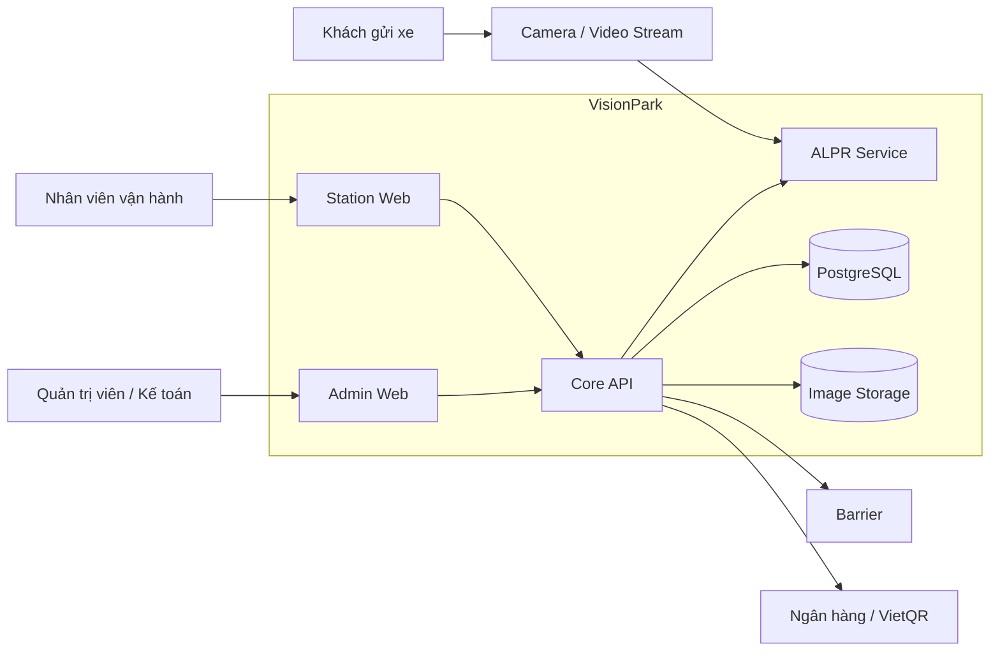
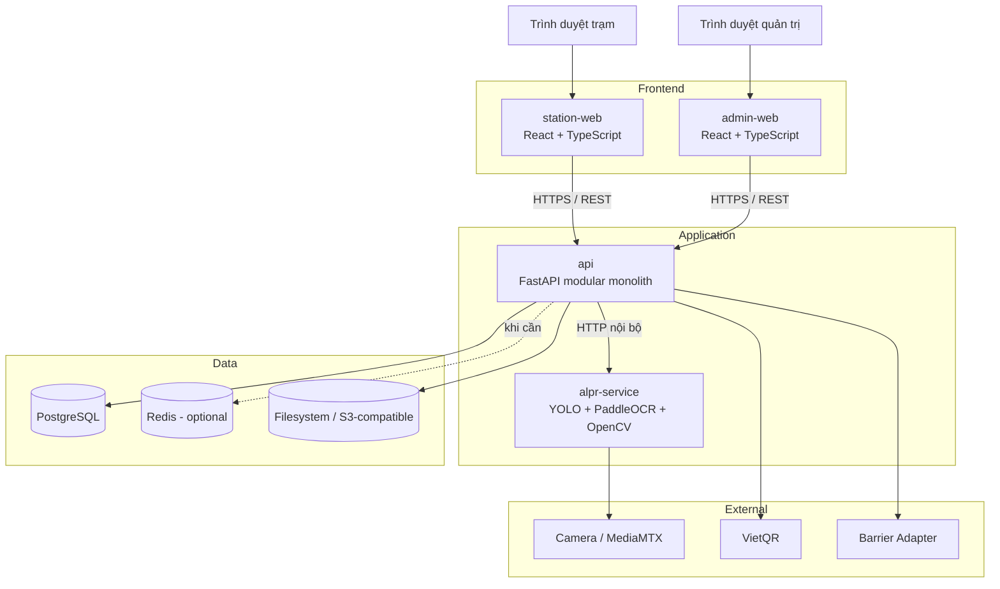
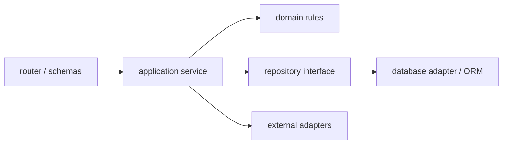
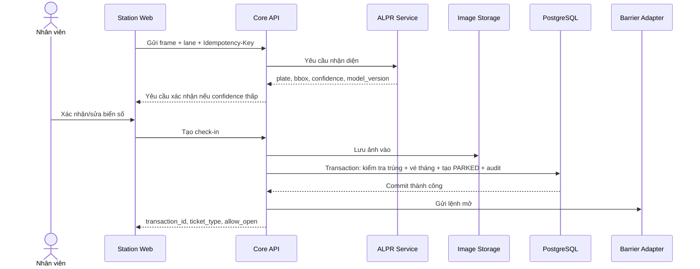
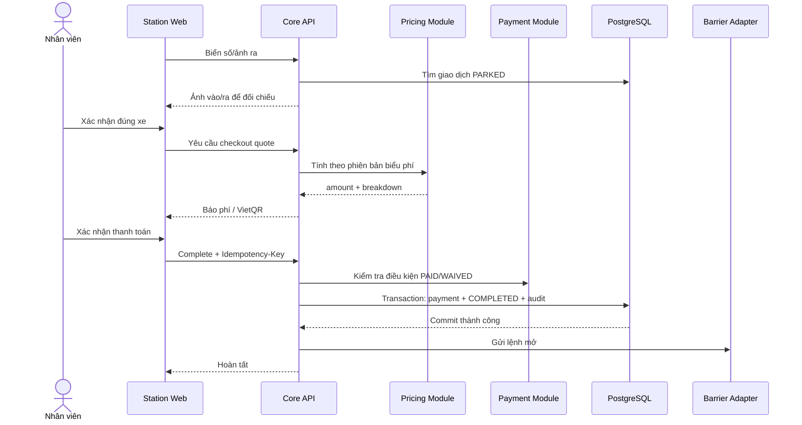
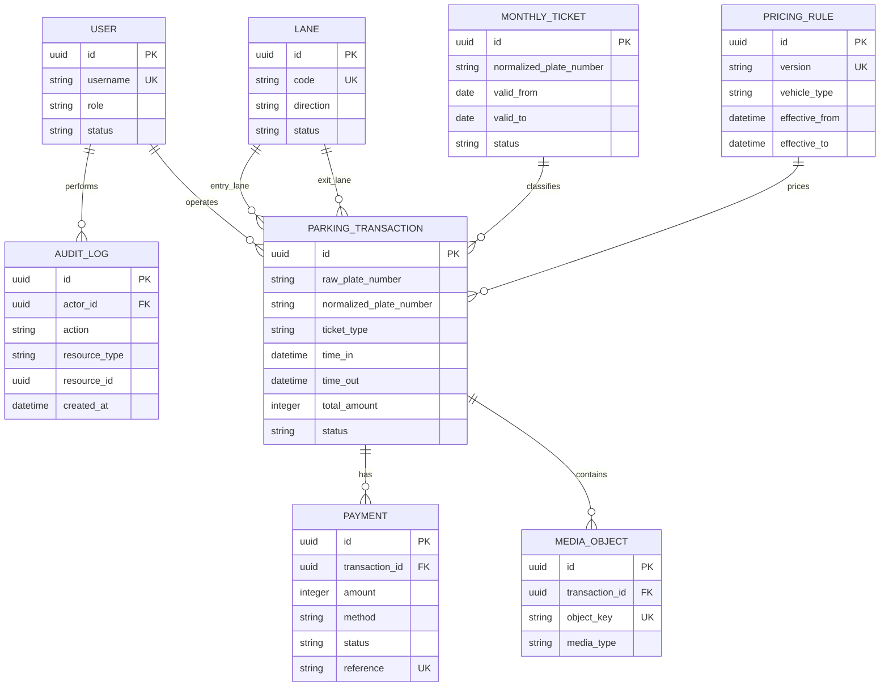

# KIẾN TRÚC HỆ THỐNG VISIONPARK

## 1. Thông tin tài liệu

| Thuộc tính | Nội dung |
| --- | --- |
| Mã tài liệu | VP-ARCH-001 |
| Phiên bản | 1.0.0 |
| Ngày chốt | 24/08/2026 |
| Phạm vi | MVP – một bãi xe, nhiều làn vào/ra |
| Kiến trúc tổng thể | Modular Monolith + ALPR Service |
| Tài liệu nghiệp vụ | [Document.md](./Document.md) |
| Trạng thái | Baseline cho Sprint 1 |

## 2. Quyết định kiến trúc đã chốt

1. Dùng **monorepo** để quản lý backend, hai ứng dụng frontend, ALPR service, hạ tầng và kiểm thử trong cùng một phiên bản.
2. Backend nghiệp vụ dùng **FastAPI/Python** theo mô hình **modular monolith**. Không tách microservice nghiệp vụ trong MVP 4 Sprint.
3. ALPR là một service độc lập vì có vòng đời model, tài nguyên CPU/GPU và cách scale khác backend nghiệp vụ.
4. Station Web và Admin Web là hai ứng dụng React độc lập, dùng chung thư viện UI, API client và kiểu dữ liệu qua `packages/`.
5. **PostgreSQL** là nguồn dữ liệu chuẩn. Redis chỉ được thêm khi có nhu cầu đo được về khóa phân tán, cache ngắn hạn hoặc hàng đợi; Redis không giữ dữ liệu nghiệp vụ duy nhất.
6. Ảnh vào/ra được lưu qua abstraction `ObjectStorage`: filesystem ở local/demo và S3-compatible storage ở môi trường thật. Database chỉ lưu object key và metadata.
7. Check-in, báo phí, thanh toán và hoàn tất check-out là các bước riêng; chỉ backend nghiệp vụ được thay đổi trạng thái giao dịch.
8. Giao tiếp trong MVP ưu tiên REST/JSON đồng bộ. Không đưa message broker vào baseline khi chưa có nhu cầu rõ ràng.
9. Tất cả thao tác ghi quan trọng phải hỗ trợ chống gửi lặp, transaction và audit log.
10. Triển khai local/demo bằng Docker Compose; cấu hình production được tách trong `infra/` và không chứa secret trong Git.

## 3. Sơ đồ ngữ cảnh hệ thống



## 4. Kiến trúc container



## 5. Cây thư mục dự án

```text
VisionPark/
├── Document.md                         # BA/BRD/SRS và tiêu chí nghiệm thu
├── architecture.md                     # Tài liệu kiến trúc này
├── README.md                            # Hướng dẫn bắt đầu dự án (tạo ở Sprint 1)
├── .env.example                        # Danh sách biến môi trường, không chứa secret
├── compose.yaml                        # Môi trường local/demo
│
├── apps/
│   ├── api/                             # Core API - FastAPI modular monolith
│   │   ├── src/
│   │   │   ├── main.py                 # Khởi tạo ứng dụng và middleware
│   │   │   ├── config/                 # Settings, logging, dependency wiring
│   │   │   ├── shared/                 # Kiểu/lỗi/tiện ích dùng chung nội bộ
│   │   │   └── modules/
│   │   │       ├── auth/               # Tài khoản, đăng nhập, RBAC
│   │   │       ├── lanes/              # Làn, camera và trạng thái thiết bị
│   │   │       ├── parking/            # Check-in/out và vòng đời giao dịch
│   │   │       ├── tickets/            # Vé tháng
│   │   │       ├── pricing/            # Phiên bản biểu phí và engine tính phí
│   │   │       ├── payments/           # Tiền mặt, VietQR, xác nhận thanh toán
│   │   │       ├── media/              # Metadata và quyền truy cập ảnh
│   │   │       ├── reports/            # Dashboard, tra cứu, báo cáo
│   │   │       └── audit/              # Nhật ký thao tác
│   │   ├── migrations/                  # Alembic migrations
│   │   ├── tests/                       # Unit và integration test backend
│   │   ├── pyproject.toml
│   │   └── Dockerfile
│   │
│   ├── station-web/                     # UI trực vận hành làn vào/ra
│   │   ├── src/
│   │   │   ├── app/                    # Router, providers, bootstrap
│   │   │   ├── features/               # check-in, check-out, camera, payment
│   │   │   ├── components/             # Component chỉ thuộc Station UI
│   │   │   └── assets/
│   │   ├── tests/
│   │   ├── package.json
│   │   └── Dockerfile
│   │
│   └── admin-web/                       # Dashboard và quản trị
│       ├── src/
│       │   ├── app/
│       │   ├── features/                # users, tickets, pricing, reports, audit
│       │   ├── components/
│       │   └── assets/
│       ├── tests/
│       ├── package.json
│       └── Dockerfile
│
├── services/
│   └── alpr/                            # Service nhận diện biển số độc lập
│       ├── src/
│       │   ├── api/                     # Endpoint inference/health
│       │   ├── detection/               # YOLO detector
│       │   ├── recognition/             # PaddleOCR
│       │   ├── normalization/           # Chuẩn hóa biển số 1/2 dòng
│       │   └── observability/            # Metrics và logging
│       ├── models/                       # Chỉ manifest; weight lớn không commit Git
│       ├── tests/
│       ├── pyproject.toml
│       └── Dockerfile
│
├── packages/
│   ├── ui/                              # Design token và component React dùng chung
│   ├── api-client/                      # Client sinh từ OpenAPI
│   └── shared-types/                    # Contract/type dùng chung frontend
│
├── infra/
│   ├── docker/                          # Cấu hình container phụ trợ
│   ├── mediamtx/                        # Cấu hình luồng video local/demo
│   ├── monitoring/                      # Metrics, dashboard và alert rules
│   └── production/                      # Manifest production khi môi trường được chốt
│
├── tests/
│   ├── e2e/                             # Luồng nghiệp vụ qua toàn hệ thống
│   ├── performance/                     # Kịch bản tải
│   ├── security/                        # Kiểm thử phân quyền và API cơ bản
│   └── fixtures/                        # Ảnh/video/dữ liệu test có quyền sử dụng
│
├── scripts/
│   ├── dev/                             # Khởi tạo và hỗ trợ môi trường local
│   ├── ci/                              # Lint, test, build, migration check
│   └── operations/                      # Backup, restore, health check
│
└── docs/
    ├── adr/                             # Architecture Decision Records
    ├── api/                             # Contract và ví dụ API bổ sung
    ├── operations/                      # Runbook vận hành và xử lý sự cố
    └── testing/                         # Test plan, UAT và báo cáo kết quả
```

## 6. Cấu trúc module backend

Mỗi module nghiệp vụ trong `apps/api/src/modules/` tuân theo cấu trúc thống nhất:

```text
<module>/
├── router.py          # HTTP endpoint, parse input, map output
├── schemas.py         # Request/response DTO
├── service.py         # Application use case và transaction boundary
├── domain.py          # Entity, value object, business rule thuần
├── repository.py      # Interface và truy cập dữ liệu
├── models.py          # ORM mapping
├── permissions.py     # Quyền theo action/resource
└── errors.py          # Lỗi nghiệp vụ có mã ổn định
```

### Quy tắc phụ thuộc



- `router` không chứa công thức phí hoặc logic chuyển trạng thái.
- `domain` không import FastAPI, ORM, HTTP client hoặc framework UI.
- Module khác gọi application service hoặc public interface, không truy cập trực tiếp bảng thuộc module.
- `parking` điều phối check-in/check-out nhưng ủy quyền việc tính tiền cho `pricing` và thanh toán cho `payments`.
- Mọi transaction database được mở/đóng ở application service.
- `audit` nhận sự kiện/thông tin từ use case; lỗi ghi audit với thao tác bắt buộc phải làm thất bại toàn bộ transaction.

## 7. Trách nhiệm các thành phần

| Thành phần | Sở hữu | Không được làm |
| --- | --- | --- |
| Station Web | Trạng thái giao diện trạm, thao tác nhanh, hiển thị video/ảnh/QR | Tự tính phí hoặc tự quyết định mở barrier |
| Admin Web | Quản trị, dashboard, tra cứu, báo cáo | Truy cập DB hoặc kho ảnh trực tiếp |
| Core API | Quy tắc nghiệp vụ, phân quyền, transaction, audit, API contract | Thực hiện inference model trực tiếp trong process API |
| ALPR Service | Detection, OCR, normalization, confidence, model version | Tạo giao dịch gửi xe hoặc quyết định loại vé/phí |
| PostgreSQL | Dữ liệu nghiệp vụ chuẩn và ràng buộc toàn vẹn | Lưu file ảnh/video nhị phân lớn trong MVP |
| Image Storage | Object ảnh và lifecycle | Cho truy cập công khai không kiểm soát |
| Redis (optional) | Cache/lock ngắn hạn có thể tái tạo | Là nguồn duy nhất của giao dịch hoặc thanh toán |
| Barrier Adapter | Chuẩn hóa lệnh/trạng thái theo thiết bị | Tự quyết định nghiệp vụ mở cổng |

## 8. Luồng xử lý trọng yếu

### 8.1. Check-in



Điểm an toàn: API chỉ gửi lệnh mở sau khi ảnh và giao dịch đã được ghi nhận thành công. Nếu lưu ảnh hoặc database lỗi, giao dịch không được xem là check-in thành công.

### 8.2. Check-out và thanh toán



## 9. Mô hình dữ liệu mức cao



### Ràng buộc bắt buộc

- Unique có điều kiện cho `normalized_plate_number` khi giao dịch ở trạng thái đang mở.
- `time_out >= time_in` khi giao dịch đã hoàn tất.
- `amount >= 0`; dùng số nguyên VND.
- Payment reference duy nhất với các phương thức cần đối soát.
- Biểu phí đã được tham chiếu không bị sửa; thay đổi tạo version mới.
- Không hard delete giao dịch, thanh toán và audit log qua API nghiệp vụ.

## 10. API và contract

- OpenAPI do Core API phát hành là contract chuẩn.
- `packages/api-client` được sinh từ OpenAPI, không viết tay trùng lặp endpoint.
- Endpoint dùng danh từ số nhiều và version `/api/v1`.
- Thời gian dùng ISO 8601 có timezone; API trả mã tiền tệ `VND`.
- Lỗi có cấu trúc thống nhất:

```json
{
  "code": "DUPLICATE_OPEN_TRANSACTION",
  "message": "Biển số đã có lượt gửi đang mở.",
  "details": {},
  "correlation_id": "01J60D9VJ2J0C34M6QS0A92QTQ"
}
```

- Các thao tác check-in, complete checkout, xác nhận payment và override nhận `Idempotency-Key`.
- API không trả filesystem path; ảnh được truy cập bằng endpoint có kiểm tra quyền hoặc signed URL ngắn hạn.
- API list bắt buộc có pagination và giới hạn kích thước trang.

## 11. Bảo mật

### 11.1. Kiểm soát truy cập

- Xác thực tập trung tại Core API; frontend không được coi là biên bảo mật.
- RBAC theo action/resource: xem, tạo, sửa, export, override, quản trị.
- Quyền xem ảnh, chỉnh phí và mở barrier cưỡng bức được tách riêng khỏi quyền vận hành thông thường.
- Service-to-service dùng credential riêng; không dùng token người dùng cho kết nối hạ tầng.

### 11.2. Bảo vệ dữ liệu

- HTTPS ở môi trường thật; kết nối nội bộ cũng phải được bảo vệ theo mô hình triển khai.
- Secret chỉ lấy từ environment/secret manager, không commit `.env` thật.
- Mật khẩu được băm bằng Argon2id hoặc thuật toán được đội bảo mật duyệt.
- Log không chứa password, access token, thông tin tài khoản ngân hàng đầy đủ hoặc nội dung nhạy cảm không cần thiết.
- Ảnh và biển số áp dụng thời hạn lưu, quyền truy cập và audit theo quyết định nghiệp vụ/pháp lý.

### 11.3. Audit

Audit bắt buộc với đăng nhập thất bại quan trọng, sửa biển số, thay biểu phí, thay quyền, xác nhận tiền, miễn/giảm, hủy giao dịch, export dữ liệu và mở barrier cưỡng bức. Audit lưu actor, action, resource, dữ liệu trước/sau, lý do, thời gian, IP và correlation ID.

## 12. Khả năng chịu lỗi

| Sự cố | Hành vi hệ thống |
| --- | --- |
| Mất camera | Cảnh báo rõ; cho phép luồng nhập tay nếu người dùng có quyền |
| ALPR timeout/lỗi | Không làm Core API chết; trả trạng thái cần nhập tay |
| Không tạo được QR | Cho thử lại hoặc chọn tiền mặt; không tự đánh dấu PAID |
| PostgreSQL lỗi | Không xác nhận check-in/out thành công; barrier không được mở tự động |
| Kho ảnh lỗi | Không hoàn tất thao tác yêu cầu bằng chứng ảnh; hiển thị hướng xử lý |
| Barrier không phản hồi | Giao dịch vẫn có trạng thái nghiệp vụ; cảnh báo và ghi audit thao tác thủ công |
| Yêu cầu gửi lặp | Trả lại kết quả lần đầu theo Idempotency-Key, không tạo bản ghi mới |
| Ổ lưu ảnh gần đầy | Cảnh báo sớm theo ngưỡng; không xóa dữ liệu ngoài lifecycle đã duyệt |

## 13. Quan sát hệ thống

### Log

- JSON có timestamp, level, service, environment, correlation ID, user ID và event code.
- Không log toàn bộ ảnh/base64 hoặc secret.
- Có thể lần theo một giao dịch xuyên từ UI → API → ALPR → adapter.

### Metrics

- Request rate, error rate và p50/p95/p99 latency theo endpoint.
- ALPR latency, confidence distribution, tỷ lệ cần nhập tay và model version.
- Số giao dịch `PARKED`, check-in/out thất bại, payment pending và override.
- Trạng thái camera/barrier, kết nối DB và dung lượng kho ảnh.

### Health check

- `/health/live`: process còn sống, không gọi dependency nặng.
- `/health/ready`: kiểm tra dependency cần thiết để nhận traffic.
- ALPR có endpoint health riêng và công bố model version đang tải.

## 14. Môi trường và triển khai

| Môi trường | Mục đích | Dữ liệu |
| --- | --- | --- |
| Local | Phát triển cá nhân bằng Docker Compose | Dữ liệu giả, ảnh/video fixture |
| Test/CI | Lint, unit, integration, contract | Tạo mới theo pipeline |
| Staging/UAT | Tích hợp và nghiệm thu | Dữ liệu test đã được phép sử dụng |
| Production | Vận hành thực tế | Dữ liệu thật, backup và giám sát đầy đủ |

### Thành phần Docker Compose local

- `api`
- `station-web`
- `admin-web`
- `alpr`
- `postgres`
- `mediamtx`
- `minio` hoặc filesystem volume cho ảnh
- `redis` chỉ bật qua profile khi đã có use case

### Quy trình phát hành

1. Lint và static analysis.
2. Unit test.
3. Integration và contract test.
4. Build image bất biến, gắn commit SHA/version.
5. Kiểm tra migration tiến/lùi ở môi trường test.
6. Deploy staging và chạy smoke/E2E.
7. Phê duyệt UAT cho release lớn.
8. Backup, deploy production, smoke test và theo dõi.

## 15. Chiến lược kiểm thử theo tầng

| Tầng | Trọng tâm |
| --- | --- |
| Unit | Chuẩn hóa biển số, tính phí, state transition, permission rule |
| Module integration | Repository, transaction, unique constraint, storage adapter |
| Contract | OpenAPI, API client, Core API ↔ ALPR, adapter QR/barrier |
| E2E | Xe vào/ra, vé tháng, vãng lai, tiền mặt, QR và ngoại lệ |
| Performance | Concurrent lanes, peak check-in/out, report query |
| Security | Authentication, RBAC, object access, injection, rate limit |
| AI evaluation | Precision/recall và exact plate accuracy trên tập test độc lập |

## 16. Các ADR cần tạo trong Sprint 1

| ADR | Quyết định | Trạng thái |
| --- | --- | --- |
| ADR-001 | FastAPI modular monolith cho Core API | Chốt |
| ADR-002 | Tách ALPR thành service riêng | Chốt |
| ADR-003 | PostgreSQL là source of truth; Redis optional | Chốt |
| ADR-004 | Local filesystem và S3-compatible ObjectStorage adapter | Chốt định hướng |
| ADR-005 | Cơ chế authentication/token và thời gian phiên | Cần thiết kế chi tiết |
| ADR-006 | Giao thức barrier và hành vi khi mất kết nối | Chờ thiết bị |
| ADR-007 | Cơ chế xác nhận chuyển khoản VietQR | Chờ nghiệp vụ/nhà cung cấp |
| ADR-008 | Chính sách lưu ảnh, audit và backup | Chờ nghiệp vụ/pháp lý |

## 17. Definition of Done về kiến trúc

Một tính năng chỉ được coi là hoàn tất khi:

- Tuân thủ ranh giới module và không đưa logic nghiệp vụ vào router/UI.
- Có migration và constraint dữ liệu tương ứng nếu thay đổi schema.
- OpenAPI, API client và ví dụ contract được cập nhật.
- Có unit/integration test cho happy path và ngoại lệ quan trọng.
- Có kiểm tra phân quyền, audit và idempotency khi áp dụng.
- Có log/metric đủ để chẩn đoán lỗi production.
- Không commit secret, model weight lớn hoặc dữ liệu/ảnh thật không được phép.
- Tài liệu BA/architecture/ADR được cập nhật nếu thay đổi quyết định đã chốt.

## 18. Nội dung chưa chốt ngoài baseline

Các mục sau không cản trở việc khởi tạo Sprint 1 nhưng phải được quyết định trước khi triển khai phần liên quan:

- Nhà cung cấp, giao thức và SDK của camera/barrier.
- Công thức biểu phí cuối cùng và chính sách vé tháng.
- Cơ chế xác nhận chuyển khoản tự động hay thủ công.
- Số làn, tải đỉnh, RPO/RTO và SLA production.
- Hạ tầng production cụ thể: on-premise hay cloud.
- Thời hạn lưu ảnh, giao dịch và audit log.

Mọi thay đổi làm phá vỡ các quyết định đã chốt ở Mục 2 phải được ghi thành ADR mới và đánh giá tác động đến tiến độ, dữ liệu, API, kiểm thử và vận hành.
