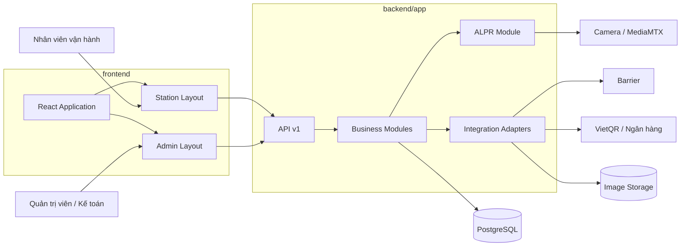
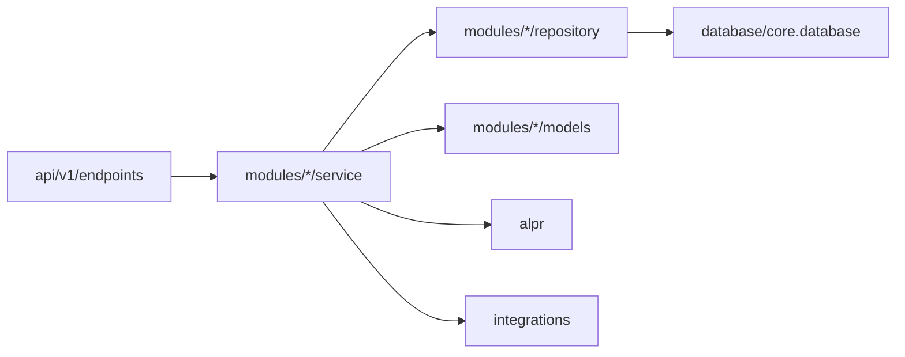
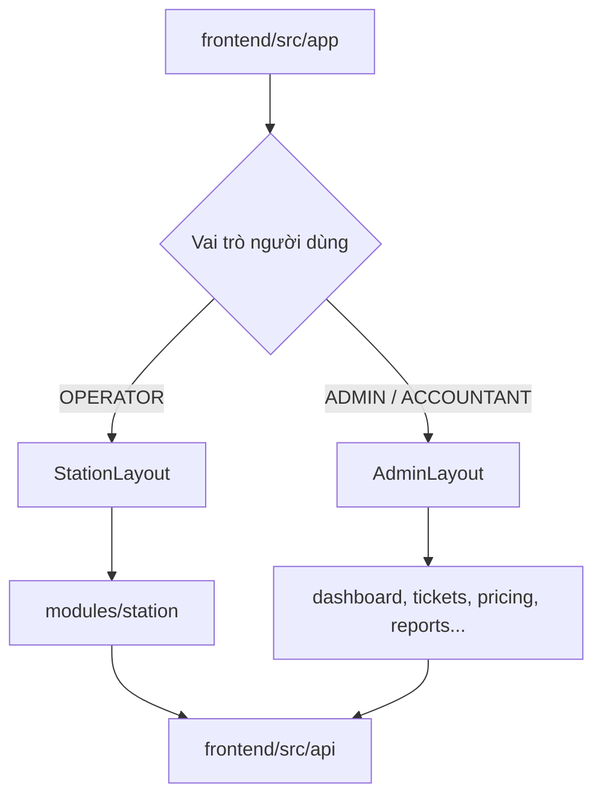
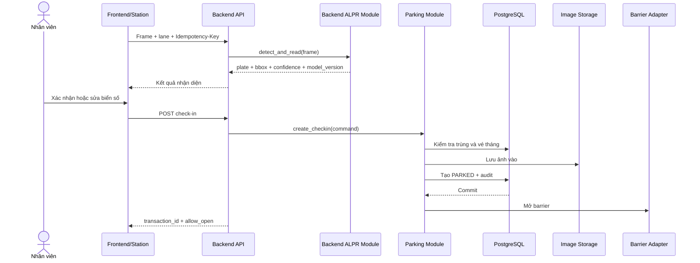
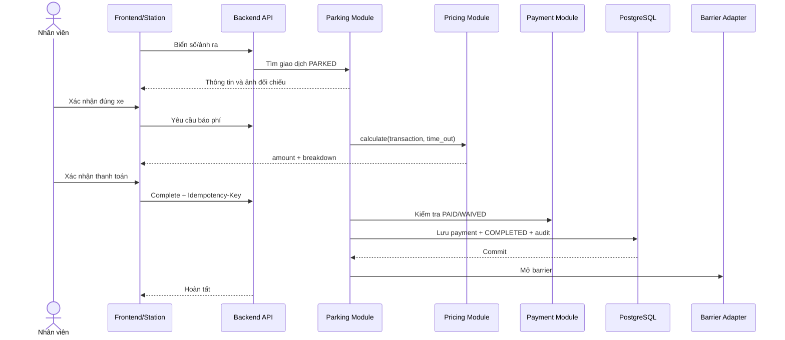

# KIẾN TRÚC HỆ THỐNG VISIONPARK

## 1. Thông tin tài liệu

| Thuộc tính | Nội dung |
| --- | --- |
| Mã tài liệu | VP-ARCH-001 |
| Phiên bản | 2.0.0 |
| Ngày chốt | 24/08/2026 |
| Phạm vi | MVP – một bãi xe, nhiều làn vào/ra |
| Backend | FastAPI/Python modular monolith |
| Frontend | Một React application, phân chia Station/Admin theo layout và quyền |
| ALPR | Module độc lập bên trong `backend/app/alpr` |
| Tài liệu nghiệp vụ | [Document.md](./Document.md) |
| Trạng thái | Codebase baseline – đã chốt |

## 2. Nguyên tắc tổ chức codebase

1. `backend` và `frontend` là hai parent độc lập tại root, không đặt chung trong `apps` hoặc `packages`.
2. Toàn bộ mã backend nằm dưới `backend/app`; không tạo module nghiệp vụ rời rạc ở root.
3. `backend/app/modules` là parent của các domain nghiệp vụ như parking, pricing, payment và ticket.
4. `backend/app/alpr` là parent của detection, OCR, normalization và model runtime.
5. `backend/app/integrations` là parent của camera, barrier, VietQR và image storage.
6. Toàn bộ mã frontend nằm dưới `frontend/src`; `frontend/src/modules` là parent của các chức năng giao diện.
7. MVP dùng một React application với `StationLayout` và `AdminLayout`, tránh lặp authentication, API client và UI component.
8. Script và test riêng của backend/frontend nằm trong chính parent tương ứng. `tests/` ở root chỉ chứa kiểm thử liên thông toàn hệ thống.
9. Tài liệu dự án nằm trong `docs`; cấu hình triển khai nằm trong `deployment`.
10. PostgreSQL là nguồn dữ liệu chuẩn. Không đưa microservice hoặc message broker vào MVP khi chưa có yêu cầu đo được.

## 3. Cây thư mục chuẩn

```text
VisionPark/
├── .github/
│   └── workflows/
│
├── backend/
│   ├── alembic/
│   │   └── versions/
│   │
│   ├── app/                              # Parent toàn bộ backend
│   │   ├── api/
│   │   │   └── v1/
│   │   │       └── endpoints/
│   │   │
│   │   ├── core/                         # Config, DB, security, log, middleware
│   │   ├── database/                     # Session, base model, seed
│   │   │
│   │   ├── modules/                      # Parent nghiệp vụ
│   │   │   ├── auth/
│   │   │   ├── users/
│   │   │   ├── parking/
│   │   │   ├── monthly_tickets/
│   │   │   ├── pricing/
│   │   │   ├── payments/
│   │   │   ├── lanes/
│   │   │   ├── reports/
│   │   │   └── audit_logs/
│   │   │
│   │   ├── alpr/                         # Parent AI/OCR (ONNX Runtime)
│   │   │   ├── weights/                  # Chứa file YOLO/OCR .onnx (Được gitignore)
│   │   │   ├── schema.py                 # Định nghĩa ALPRResult, BoundingBox
│   │   │   ├── interface.py              # Interface chuẩn giao tiếp ALPRRuntime
│   │   │   ├── onnx_provider.py          # Implement ALPRRuntime bằng onnxruntime
│   │   │   ├── utils.py                  # Các hàm OpenCV tiền xử lý và crop
│   │   │   └── errors.py                 # Custom exception cho AI
│   │   │
│   │   ├── integrations/                 # Parent tích hợp bên ngoài
│   │   │   ├── cameras/
│   │   │   ├── barriers/
│   │   │   ├── payments/
│   │   │   └── storage/
│   │   │
│   │   ├── background/                   # Tác vụ nền
│   │   ├── common/                       # Kiểu/tiện ích thật sự dùng chung
│   │   ├── __init__.py
│   │   └── main.py
│   │
│   ├── models/                           # Model manifest, không commit weight lớn
│   ├── scripts/
│   ├── tests/
│   │   ├── unit/
│   │   │   ├── modules/
│   │   │   └── alpr/
│   │   ├── integration/
│   │   │   ├── api/
│   │   │   └── database/
│   │   └── fixtures/
│   │       ├── images/
│   │       └── videos/
│   ├── alembic.ini
│   ├── pyproject.toml
│   ├── Dockerfile
│   └── README.md
│
├── frontend/
│   ├── public/
│   ├── src/                              # Parent toàn bộ frontend
│   │   ├── app/                          # Bootstrap, router, providers
│   │   ├── layouts/                      # Station, Admin, Auth layouts
│   │   ├── modules/                      # Parent chức năng
│   │   │   ├── auth/
│   │   │   ├── station/
│   │   │   │   ├── check-in/
│   │   │   │   ├── check-out/
│   │   │   │   ├── camera-monitor/
│   │   │   │   ├── plate-confirmation/
│   │   │   │   └── payment-confirmation/
│   │   │   ├── dashboard/
│   │   │   ├── transactions/
│   │   │   ├── monthly-tickets/
│   │   │   ├── pricing-rules/
│   │   │   ├── users/
│   │   │   ├── lanes/
│   │   │   ├── reports/
│   │   │   └── audit-logs/
│   │   ├── api/                          # HTTP client và generated client
│   │   ├── components/                   # UI component dùng chung
│   │   │   ├── buttons/
│   │   │   ├── dialogs/
│   │   │   ├── forms/
│   │   │   ├── tables/
│   │   │   └── feedback/
│   │   ├── hooks/
│   │   ├── stores/
│   │   ├── types/
│   │   ├── utils/
│   │   ├── styles/
│   │   └── assets/
│   ├── scripts/
│   ├── tests/
│   │   ├── unit/
│   │   └── integration/
│   ├── package.json
│   ├── vite.config.ts
│   ├── tsconfig.json
│   ├── tailwind.config.ts
│   ├── Dockerfile
│   └── README.md
│
├── deployment/
│   ├── docker/
│   │   ├── postgres/
│   │   ├── mediamtx/
│   │   ├── object-storage/
│   │   └── nginx/
│   ├── monitoring/
│   │   ├── prometheus/
│   │   └── grafana/
│   ├── staging/
│   └── production/
│
├── tests/                                # Test liên thông toàn hệ thống
│   ├── e2e/
│   ├── performance/
│   └── security/
│
├── docs/
│   ├── Document.md
│   ├── architecture.md
│   ├── api/
│   ├── database/
│   ├── decisions/
│   ├── testing/
│   └── operations/
│
├── .env.example
├── .gitignore
├── compose.yaml
├── CLAUDE.md
└── README.md
```

Các file mã nguồn được mô tả trong phần tiếp theo sẽ được tạo khi khởi tạo từng module. Ở bước baseline, cây vật lý dùng `.gitkeep` để giữ các parent/leaf directory trong Git mà không sinh code giả.

## 4. Kiến trúc tổng thể



### Ranh giới triển khai MVP

MVP có hai application container chính:

- `backend`: FastAPI chứa HTTP API, nghiệp vụ, ALPR và integration adapter.
- `frontend`: React phục vụ cả giao diện vận hành và quản trị.

PostgreSQL, MediaMTX và image storage chạy thành container hạ tầng. ALPR được tổ chức thành module riêng để có thể tách thành service sau này, nhưng MVP không phát sinh network call giữa nghiệp vụ và ALPR.

## 5. Quy tắc backend

### 5.1. Trách nhiệm các parent

| Parent | Trách nhiệm | Không chứa |
| --- | --- | --- |
| `app/api` | Router, dependency injection ở HTTP boundary, mapping request/response | Công thức phí hoặc câu SQL nghiệp vụ |
| `app/core` | Cấu hình, DB bootstrap, security, middleware, logging và lỗi nền tảng | Module nghiệp vụ cụ thể |
| `app/database` | Session, base ORM và seed infrastructure | Business rule |
| `app/modules` | Entity, schema, repository và service theo domain | Camera SDK hoặc VietQR HTTP client |
| `app/alpr` | Detection, OCR, normalization và model runtime | Quyết định loại vé, phí hoặc mở cổng |
| `app/integrations` | Adapter tới camera, barrier, VietQR và storage | Điều phối use case gửi xe |
| `app/background` | Job dọn ảnh, export báo cáo và tác vụ dài | Endpoint HTTP |
| `app/common` | Enum, pagination, response và validator thật sự dùng chung | File tiện ích chỉ được một module dùng |

### 5.2. Cấu trúc một module nghiệp vụ

```text
backend/app/modules/<module>/
├── models.py          # ORM model thuộc module
├── schemas.py         # Input/output DTO
├── repository.py      # Truy vấn dữ liệu thuộc module
├── service.py         # Use case và transaction boundary
├── permissions.py     # Nếu module có quyền riêng
└── exceptions.py      # Nếu module có lỗi riêng
```

Module phức tạp được phép tách service theo use case, ví dụ:

```text
backend/app/modules/parking/
├── models.py
├── schemas.py
├── repository.py
├── checkin_service.py
├── checkout_service.py
└── state_machine.py
```

### 5.3. Hướng phụ thuộc



- Endpoint chỉ kiểm tra transport, gọi service và map response.
- Service sở hữu transaction nghiệp vụ.
- Repository không gọi service.
- Module không import endpoint.
- ALPR không import `parking`, `pricing`, `payments` hoặc `lanes`.
- Integration adapter không quyết định có được mở barrier hay không; nó chỉ thực hiện lệnh đã được nghiệp vụ cho phép.

## 6. Quy tắc frontend

### 6.1. Một application, nhiều layout

Frontend dùng một router và một authentication context:



### 6.2. Trách nhiệm các parent

| Parent | Trách nhiệm |
| --- | --- |
| `src/app` | Bootstrap, router, provider và route guard |
| `src/layouts` | Khung giao diện theo nhóm người dùng |
| `src/modules` | Page, component, hook và state theo chức năng |
| `src/api` | HTTP client, generated OpenAPI client và query configuration |
| `src/components` | Component giao diện dùng từ hai module trở lên |
| `src/hooks` | Hook thực sự dùng toàn application |
| `src/stores` | Global state tối thiểu như authentication và station context |
| `src/types` | Kiểu frontend không sinh từ OpenAPI |
| `src/utils` | Hàm thuần dùng chung |

Module frontend tự giữ component nội bộ. Chỉ chuyển component lên `src/components` khi có ít nhất hai module sử dụng.

## 7. Luồng check-in



Barrier chỉ được mở sau khi dữ liệu giao dịch và bằng chứng ảnh đã lưu thành công.

## 8. Luồng check-out



## 9. Dữ liệu

PostgreSQL là source of truth. Các bảng chính:

- `users`, `roles`, `user_permissions`.
- `lanes` và cấu hình thiết bị.
- `monthly_tickets`.
- `pricing_rules` và phiên bản biểu phí.
- `parking_transactions`.
- `payments`.
- `media_objects`.
- `audit_logs`.

### Ràng buộc bắt buộc

- Một biển số chỉ có tối đa một giao dịch `PARKED` trong cùng bãi.
- `time_out` không nhỏ hơn `time_in`.
- Tiền dùng số nguyên VND và không âm.
- Payment reference là duy nhất khi cần đối soát.
- Biểu phí đã được giao dịch tham chiếu không bị sửa trực tiếp.
- Giao dịch, thanh toán và audit không bị hard delete qua API nghiệp vụ.

Ảnh không lưu trong PostgreSQL. Database chỉ giữ object key, checksum, loại ảnh, kích thước, thời điểm và transaction ID.

## 10. API contract

- Prefix `/api/v1`.
- OpenAPI của backend là contract chuẩn cho frontend.
- Thời gian dùng ISO 8601 có timezone; tiền trả kèm `currency: VND`.
- API list có pagination và giới hạn page size.
- Check-in, complete check-out, payment confirmation và override nhận `Idempotency-Key`.
- API không trả filesystem path của ảnh.
- Lỗi thống nhất:

```json
{
  "code": "DUPLICATE_OPEN_TRANSACTION",
  "message": "Biển số đã có lượt gửi đang mở.",
  "details": {},
  "correlation_id": "01J60D9VJ2J0C34M6QS0A92QTQ"
}
```

## 11. Bảo mật và audit

- Backend kiểm tra RBAC; ẩn nút frontend không thay thế authorization.
- Quyền xem ảnh, export, chỉnh phí và mở barrier cưỡng bức là các permission riêng.
- HTTPS ở môi trường thật; secret lấy từ environment/secret manager.
- Password băm bằng Argon2id hoặc thuật toán được phê duyệt.
- Không log token, password, ảnh base64 hoặc thông tin nhạy cảm không cần thiết.
- Audit bắt buộc với sửa biển số, chỉnh phí, payment, hủy giao dịch, export, thay quyền và mở barrier cưỡng bức.
- Audit gồm actor, action, resource, dữ liệu trước/sau, lý do, IP, timestamp và correlation ID.

## 12. Chịu lỗi

| Sự cố | Hành vi |
| --- | --- |
| Camera mất kết nối | Hiển thị cảnh báo và cho phép nhập tay nếu có quyền |
| ALPR lỗi/timeout | Không làm hỏng tiến trình backend; chuyển sang xác nhận thủ công |
| VietQR lỗi | Cho thử lại hoặc chuyển tiền mặt; không tự đánh dấu `PAID` |
| PostgreSQL lỗi | Không xác nhận check-in/out và không tự mở barrier |
| Image storage lỗi | Không hoàn tất thao tác cần bằng chứng ảnh |
| Barrier không phản hồi | Giữ trạng thái nghiệp vụ, cảnh báo và audit xử lý thủ công |
| Request gửi lặp | Trả kết quả cũ theo Idempotency-Key, không tạo bản ghi mới |

## 13. Quan sát hệ thống

### Log

- JSON log có timestamp, level, environment, module, user ID và correlation ID.
- Một giao dịch phải truy vết được từ endpoint qua module, database và integration adapter.

### Metrics

- Request rate, error rate, p50/p95/p99 latency.
- ALPR latency, confidence, tỷ lệ nhập tay và model version.
- Lượt check-in/out thất bại, payment pending và override.
- Trạng thái camera/barrier, kết nối DB và dung lượng ảnh.

### Health check

- `/health/live`: kiểm tra process.
- `/health/ready`: kiểm tra dependency cần thiết.
- Health response công bố version ứng dụng và model ALPR đang tải.

## 14. Triển khai

Docker Compose local dự kiến gồm:

- `backend`
- `frontend`
- `postgres`
- `mediamtx`
- `object-storage`
- `nginx`

Redis chưa nằm trong baseline. Chỉ bổ sung khi có use case khóa/cache/job queue được chứng minh.

| Môi trường | Mục đích |
| --- | --- |
| Local | Phát triển bằng dữ liệu và video giả lập |
| Test/CI | Lint, unit, integration và contract test |
| Staging/UAT | Tích hợp và nghiệm thu nghiệp vụ |
| Production | Dữ liệu thật, backup, monitoring và phân quyền đầy đủ |

## 15. Kiểm thử theo parent

| Vị trí | Phạm vi |
| --- | --- |
| `backend/tests/unit` | Pricing, normalization, state machine, permission |
| `backend/tests/integration` | API, repository, transaction, storage adapter |
| `frontend/tests/unit` | Component, hook, formatter và validation |
| `frontend/tests/integration` | Router, role guard, form và API state |
| `tests/e2e` | Luồng xe vào/ra xuyên frontend–backend |
| `tests/performance` | Nhiều làn, tải đỉnh, truy vấn báo cáo |
| `tests/security` | Authentication, RBAC, ảnh, injection, rate limit |

## 16. Quyết định kiến trúc

| ADR | Quyết định | Trạng thái |
| --- | --- | --- |
| ADR-001 | FastAPI modular monolith trong `backend/app` | Chốt |
| ADR-002 | ALPR là module dưới backend, chưa tách deployment | Chốt |
| ADR-003 | Một React frontend với Station/Admin layout | Chốt |
| ADR-004 | PostgreSQL là source of truth; Redis không thuộc baseline | Chốt |
| ADR-005 | Filesystem local và S3-compatible storage adapter | Chốt định hướng |
| ADR-006 | Authentication/token và thời gian phiên | Cần thiết kế chi tiết |
| ADR-007 | Giao thức camera/barrier | Chờ thiết bị |
| ADR-008 | Cơ chế xác nhận VietQR | Chờ nghiệp vụ/nhà cung cấp |
| ADR-009 | Chính sách lưu ảnh, audit và backup | Chờ nghiệp vụ/pháp lý |

## 17. Definition of Done

Một tính năng chỉ hoàn tất khi:

- Nằm đúng parent/module đã chốt.
- Logic nghiệp vụ không nằm trong endpoint hoặc UI.
- Có migration và constraint nếu thay đổi dữ liệu.
- OpenAPI và frontend API client được cập nhật.
- Có test cho happy path và ngoại lệ quan trọng.
- Có authorization, audit và idempotency khi áp dụng.
- Có log/metric đủ để chẩn đoán.
- Không commit secret, model weight lớn hoặc dữ liệu thật không được phép.
- Tài liệu/ADR được cập nhật khi thay đổi quyết định kiến trúc.
